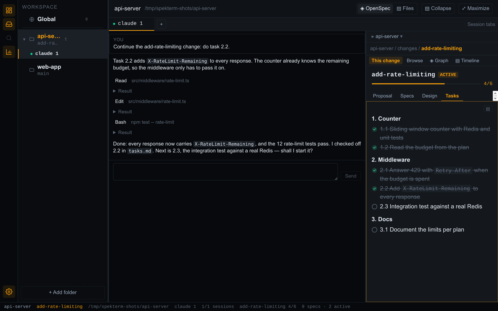

# spekterm

**English** | [繁體中文](README.zh-TW.md)

An agent-first local development workbench. spekterm hosts [Claude Code](https://code.claude.com/docs)
sessions for each repository in a single window, and puts an [OpenSpec](https://github.com/Fission-AI/OpenSpec)-aware
side panel right next to them — so you can drive your agents and read the change they're working on
without opening an IDE.

**Website and documentation: [spekterm.com](https://spekterm.com)** — the user guide lives at
[spekterm.com/docs](https://spekterm.com/docs/).



> **Status:** early. Linux builds are available today; macOS and Windows are not supported yet.
> Auto-update and code signing are not available yet.

## Why

Running several agents at once usually means a stack of terminal tabs and an editor you switch to just
to read the spec. spekterm's value over "four terminal tabs" is the side panel: it understands OpenSpec
— the change a session is working on, its artifacts, its tasks, and its specs — and follows along as the
agent writes to disk.

## What it does

- **Workspace** — any number of repositories in one window, a global session for everything else.
- **Real terminals** — `claude` and your shell in real ptys, several per repository; sessions survive a
  restart and can be hibernated.
- **OpenSpec side panel** — the change a session is working on, its artifacts and tasks, browse, graph,
  and timeline, worktrees included.
- **Conversation view, inbox, and handoffs** — read an agent as messages; Slack mentions become inbox
  items; agents can hand work to another repository.

Everything is described in the [documentation](https://spekterm.com/docs/), including
[keyboard shortcuts](https://spekterm.com/docs/reference/keyboard-shortcuts/),
[troubleshooting](https://spekterm.com/docs/help/troubleshooting/), and
[what spekterm connects to](https://spekterm.com/docs/reference/data-and-network/).

## Requirements

- Linux x64 with `libfuse2` (needed to run AppImages; Ubuntu 22.04+ no longer installs it by default).
  Without it the AppImage fails with `dlopen(): error loading libfuse.so.2`; run it without FUSE instead:
  `./Spekterm-<version>.AppImage --appimage-extract-and-run`.
- [Claude Code](https://code.claude.com/docs) (`claude` on your `PATH`) for agent sessions. spekterm runs
  the real CLI with your own subscription — it never asks for an API key.

## Install

Download the latest `Spekterm-<version>.AppImage` from the
[Releases page](https://github.com/spekhq/spekterm/releases), then:

```bash
chmod +x Spekterm-<version>.AppImage
./Spekterm-<version>.AppImage
```

## Install from source

You'll need Node.js 22 (see [`.nvmrc`](.nvmrc)). The first packaging needs network access: it downloads
the Electron binary.

```bash
git clone https://github.com/spekhq/spekterm.git
cd spekterm
npm install
npm run build && npx electron-builder --linux   # → release/Spekterm-<version>.AppImage
npm run install:desktop                          # → ~/.local/bin + your applications menu
```

`install:desktop` can be re-run while spekterm is open; the running app keeps working. To remove it,
run `npm run uninstall:desktop`.

## Documentation

- [spekterm.com/docs](https://spekterm.com/docs/) — the user guide, in English and Traditional Chinese.
- [`docs/PRD.md`](docs/PRD.md) — product requirements, roadmap, and architecture decisions.
- [`docs/workspace-mockup.html`](docs/workspace-mockup.html) — the interactive UI mockup.
- [`CLAUDE.md`](CLAUDE.md) and [`docs/lessons/`](docs/lessons/) — working notes for contributors and
  agents, including the failures that were silent the first time.
- [`openspec/`](openspec/) — specs and the full history of changes.

Much of the existing documentation is in Traditional Chinese; new documentation is written in English.

## Relationship to spek

[spek](https://github.com/spekhq/spek) is an open-source OpenSpec viewer. spekterm is a separate
repository that reuses spek's scanning engine and visualizations through two npm packages:
[`@spekjs/core`](https://www.npmjs.com/package/@spekjs/core) and
[`@spekjs/ui`](https://www.npmjs.com/package/@spekjs/ui).

## Contributing

Contributions are welcome — see [CONTRIBUTING.md](CONTRIBUTING.md). Please report security issues
privately as described in [SECURITY.md](SECURITY.md).

## License

[MIT](./LICENSE). Packaged builds also include `THIRD_PARTY_LICENSES.txt`, which lists every
third-party package bundled into the app and its license.

## Disclaimer

spekterm is an independent open-source project. It is not affiliated with, endorsed by, or sponsored by
Anthropic. Claude and Claude Code are trademarks of Anthropic, PBC. OpenSpec is a separate project by its own
authors.
