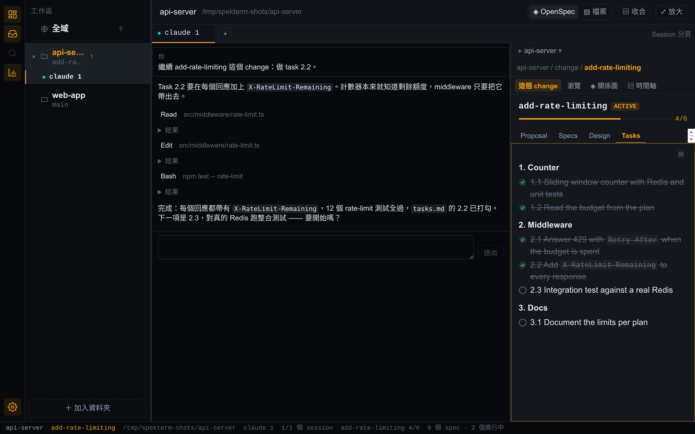

# spekterm

[English](README.md) | **繁體中文**

一個以 agent 為核心的本地開發工作台。spekterm 在同一個視窗裡為每個 repo 跑
[Claude Code](https://code.claude.com/docs) session，旁邊再放一塊懂 [OpenSpec](https://github.com/Fission-AI/OpenSpec)
的側欄 —— 讓你不必另開 IDE，就能一邊駕駛 agent、一邊讀它正在做的那個 change。

**官網與文件：[spekterm.com](https://spekterm.com/zh-tw/)** —— 使用說明在
[spekterm.com/docs](https://spekterm.com/docs/)（[繁體中文版](https://spekterm.com/zh-tw/docs/)）。



> **現況：** 早期版本。目前提供 Linux（x86_64）與 Apple Silicon 的 macOS 版本；Windows 與 Intel Mac
> 尚未支援。還沒有自動更新，macOS 版也沒有經過 Apple 公證（它以 ad hoc 方式簽章 —— 見 [macOS](#macos)）。

## 為什麼

同時跑好幾個 agent，通常代表一疊終端機分頁，外加一個只為了讀 spec 而切過去的編輯器。spekterm 相對於
「開四個終端機分頁」的價值在側欄：它懂 OpenSpec —— session 正在做的 change、它的 artifact、tasks 與
spec —— 並且在 agent 寫入磁碟時跟著更新。

## 它做什麼

- **工作區** —— 一個視窗放任意多個 repo，外加一個給其他所有事情用的全域 session。
- **真正的終端** —— `claude` 與你的 shell 跑在真正的 pty 裡，每個 repo 可開多個；session 重開 app 也還在，
  也能休眠。
- **OpenSpec 側欄** —— session 正在做的 change、它的 artifact 與 tasks，瀏覽、關係圖、時間軸，含 worktree。
- **對話檢視、收件匣與交接** —— 以訊息形式讀 agent；Slack 提及會變成收件匣項目；agent 可以把工作交給
  另一個 repo。

完整說明都在[文件](https://spekterm.com/zh-tw/docs/)，包括[快捷鍵](https://spekterm.com/zh-tw/docs/reference/keyboard-shortcuts/)、
[疑難排解](https://spekterm.com/zh-tw/docs/help/troubleshooting/)，以及
[spekterm 會連到哪裡](https://spekterm.com/zh-tw/docs/reference/data-and-network/)。

## 需求

- Linux x64，並安裝 `libfuse2`（執行 AppImage 需要；Ubuntu 22.04 起預設不再安裝）。
  少了它，AppImage 會以 `dlopen(): error loading libfuse.so.2` 失敗；可改為不經 FUSE 執行：
  `./Spekterm-<version>.AppImage --appimage-extract-and-run`。
- 或是 Apple Silicon 的 macOS 12（Monterey）以上。已在 macOS 13（Ventura）上測試。
- [Claude Code](https://code.claude.com/docs)（`claude` 在 `PATH` 上），用於 agent session。spekterm
  執行的是真正的 CLI、用你自己的訂閱 —— 從不要求 API key。

## 安裝

### Linux

從 [Releases 頁面](https://github.com/spekhq/spekterm/releases)下載最新的 `Spekterm-<version>.AppImage`，然後：

```bash
chmod +x Spekterm-<version>.AppImage
./Spekterm-<version>.AppImage
```

spekterm 的資料放在 `~/.config/Spekterm`。

### macOS

從 [Releases 頁面](https://github.com/spekhq/spekterm/releases)下載最新的 `Spekterm-<version>-arm64.dmg`，
打開它，把 **Spekterm** 拖進 **應用程式**（Applications）。這就是安裝；macOS 上沒有 `install:desktop`。

- **第一次啟動。** 這個 app 沒有經過公證（那需要付費的 Apple Developer ID）；它以 ad hoc 方式簽章，
  所以 macOS 會以「來自未識別的開發者」為由擋下它。macOS 14 及更早的版本：在「應用程式」裡按住
  Control 點一下（或按右鍵）app → **打開** → **打開**；或先試著打開它，再到 **系統設定 → 隱私權與安全性
  → 強制打開**（Open Anyway）。macOS 15 以後沒有 Control 點一下這條路了：先試著打開它一次，再到
  **系統設定 → 隱私權與安全性 → 強制打開**，並輸入密碼確認。每安裝一個版本只會發生一次。
- **「Spekterm 已損毀，無法打開」。** 移除隔離標記，再打開一次：
  `xattr -dr com.apple.quarantine /Applications/Spekterm.app`。
- **隱私權提示會掛著 Spekterm 的名字。** session 裡執行的程式所引發的提示，macOS 會算在 spekterm 頭上 ——
  讀取家目錄底下檔案的 agent，可能引發行事曆、照片、聯絡人、提醒事項、桌面、文件或下載項目的提示。
  拒絕它們是安全的，除非你有某個 repo 就放在那個受保護的位置（放在「文件」裡的 repo 需要「文件」的取用權限）。
- **更新。** 每一個建置對 macOS 來說都是新的身分，所以裝了新版之後，macOS 可能會再問一次你先前允許過的
  權限，包括那些隱私權提示。
- **資料**放在 `~/Library/Application Support/Spekterm`。
- **關掉視窗**會結束每個 session（若有 session 在執行，會先問你），但 spekterm 會像「終端機」與 iTerm2
  那樣繼續在 Dock 裡執行；點 Dock 圖示就會拿回視窗，session 以休眠狀態還原。沒有視窗地執行時，收件匣
  與 Slack 檢查（若有設定，每五分鐘一次）照常運作。`Cmd+Q` 會像關掉視窗那樣先問；從 Dock 結束、登出
  或關機則不會問正在執行的 session（仍會問未儲存的檔案）。

macOS 上已知的限制：還原的 shell 會在它的資料夾重新啟動，而不是在它最後的目錄；狀態列不顯示 focused
session 的工作目錄與 git 狀態；閒置的 shell 永遠不會被自動休眠（手動休眠照常可用）；字型設定只提供系統
預設的等寬字型；`Ctrl+↑` / `Ctrl+↓` 在 macOS 的預設設定裡被「指揮中心」與「App Exposé」拿走了（到
系統設定 → 鍵盤 → 鍵盤快速鍵 → 指揮中心 把它們關掉）；沒有 `Cmd+W` —— 關閉 session 用 `Ctrl+Shift+W`。
見[安裝說明](https://spekterm.com/zh-tw/docs/getting-started/install/#在-macos-上安裝)。

## 從原始碼安裝

需要 Node.js 22（見 [`.nvmrc`](.nvmrc)）。第一次打包需要網路：它會下載 Electron 的執行檔。

```bash
git clone https://github.com/spekhq/spekterm.git
cd spekterm
npm install
npm run build && npx electron-builder --linux   # → release/Spekterm-<version>.AppImage
npm run install:desktop                          # → ~/.local/bin ＋ 應用程式選單
```

`install:desktop` 可以在 spekterm 開著時重跑，執行中的 app 不受影響。移除用 `npm run uninstall:desktop`。

### 在 macOS 上

建置 macOS 版需要一台 Mac。`npm run dist:mac` 建置一個發佈版本：除非 checkout 是乾淨的發佈 commit
（`chore(release): <version>`），否則它拒絕執行；接著它跑 `npm ci`、建置、以釘住的 checksum 驗證 Electron
的壓縮檔，然後打包出 `release/Spekterm-<version>-arm64.dmg`。下載 Electron 壓縮檔需要網路。

```bash
npm run dist:mac                                   # 在發佈 commit 上 → release/Spekterm-<version>-arm64.dmg
npm run build && node scripts/package-mac.mjs      # 在其他任何 commit 試建 —— 不是發佈版本
```

試建的產物不是發佈版本：若有未提交的變更，它的 **設定 → 關於** 會標示出來。
GitHub 的 Electron 下載太慢時，把 `ELECTRON_MIRROR` 指向鏡像站（例如
`ELECTRON_MIRROR=https://npmmirror.com/mirrors/electron/`）。它對 `npm ci`／`npm install` 與打包都有效，
而釘住的 checksum 照樣適用。

## 文件

- [spekterm.com/docs](https://spekterm.com/zh-tw/docs/) —— 使用說明，有英文與繁體中文。
- [`docs/PRD.md`](docs/PRD.md) —— 產品需求、路線圖與架構決策。
- [`docs/workspace-mockup.html`](docs/workspace-mockup.html) —— 互動式 UI 雛型。
- [`CLAUDE.md`](CLAUDE.md) 與 [`docs/lessons/`](docs/lessons/) —— 給貢獻者與 agent 的工作筆記，包含那些
  第一次發生時是靜默的失敗。
- [`openspec/`](openspec/) —— 規格與完整的 change 歷史。

既有的文件多數是繁體中文；新的文件以英文撰寫。

## 與 spek 的關係

[spek](https://github.com/spekhq/spek) 是開源的 OpenSpec 檢視器。spekterm 是獨立的 repo，透過兩個 npm
套件重用 spek 的掃描引擎與視覺化元件：[`@spekjs/core`](https://www.npmjs.com/package/@spekjs/core) 與
[`@spekjs/ui`](https://www.npmjs.com/package/@spekjs/ui)。

## 參與貢獻

歡迎貢獻 —— 請見 [CONTRIBUTING.md](CONTRIBUTING.md)（英文）。資安問題請依 [SECURITY.md](SECURITY.md)
私下回報。

## 授權

[MIT](./LICENSE)。打包出的產物另附 `THIRD_PARTY_LICENSES.txt`，列出被打包進 app 的每一個第三方套件
與它的授權。

## 聲明

spekterm 是獨立的開源專案，與 Anthropic 沒有隸屬、背書或贊助關係。Claude 與 Claude Code 是 Anthropic, PBC
的商標。OpenSpec 是另一群作者的獨立專案。
